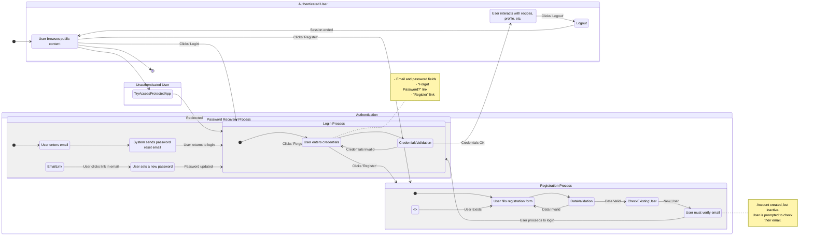

<user_journey_analysis>
### 1. User Paths

Based on the provided documents, the following user paths have been identified:

*   **Unauthenticated Access:** A new or logged-out user visits the application and can access public pages.
*   **Access to Protected Routes:** An unauthenticated user attempts to access a protected area (e.g., `/app/recipes`) and is redirected to the login page.
*   **User Registration:** A new user creates an account using their email and password. This involves filling out a form, client-side validation, and an email verification step.
*   **User Login:** A registered user signs into their account. This involves submitting credentials, validation, and redirection to the main application upon success.
*   **User Logout:** A logged-in user signs out of their account, ending their session and redirecting them to a public page.
*   **Password Recovery:** A user who has forgotten their password can request a reset link via email and set a new password.
*   **Post-Verification Flow:** A user clicks the verification link in their email, confirms their account, and is then able to log in.

### 2. Main Journeys and States

#### A. Main Application Journey
*   **[*] (Initial State):** Represents a user first arriving at the application.
*   **Public Pages:** The user browses publicly accessible content (e.g., home page).
*   **Protected App:** The user accesses the core, authenticated features of the application (e.g., recipe dashboard).
*   **[*] (Final State):** The user leaves the application.

#### B. Authentication Journey
*   **Login:** The process of signing in.
    *   `LoginForm`: User enters credentials.
    *   `CredentialsValidation`: System checks if credentials are valid.
*   **Registration:** The process of creating a new account.
    *   `RegistrationForm`: User provides registration details.
    *   `DataValidation`: System validates the provided data (e.g., password match, email format).
    *   `CheckExistingUser`: System checks if the email is already registered.
    *   `AwaitEmailVerification`: User is informed they need to verify their email.
*   **Password Recovery:** The process of resetting a forgotten password.
    *   `ForgotPasswordForm`: User enters their email to request a reset link.
    *   `UpdatePasswordForm`: User sets a new password after clicking the reset link.

### 3. Decision Points and Alternative Paths

*   **Accessing App:**
    *   If authenticated -> Go to **Protected App**.
    *   If unauthenticated -> Redirect to **Login**.
*   **Login Form:**
    *   Successful login -> Go to **Protected App**.
    *   Invalid credentials -> Show error on **LoginForm**.
    *   Forgot password -> Go to **Password Recovery**.
    *   No account -> Go to **Registration**.
*   **Registration Form:**
    *   Data invalid -> Show error on **RegistrationForm**.
    *   User already exists -> Show error on **RegistrationForm**.
    *   Successful submission -> Go to **AwaitEmailVerification**.
*   **Email Verification:**
    *   User clicks verification link -> Account is activated, user can now log in.

### 4. State Descriptions

*   **Public Pages:** The initial landing area for any user, showcasing general information without requiring a login.
*   **Protected App:** The core application functionality, accessible only to authenticated users (e.g., managing recipes).
*   **LoginForm:** The screen where users enter their email and password to sign in. It includes links to register or recover a password.
*   **RegistrationForm:** The screen where new users sign up by providing an email and password.
*   **AwaitEmailVerification:** A state indicating the user has successfully registered but must verify their email before they can log in.
*   **ForgotPasswordForm:** The screen where a user can request a password reset link.
*   **UpdatePasswordForm:** The screen, accessed via the reset link, where the user can set a new password.
</user_journey_analysis>
<mermaid_diagram>

</mermaid_diagram>

